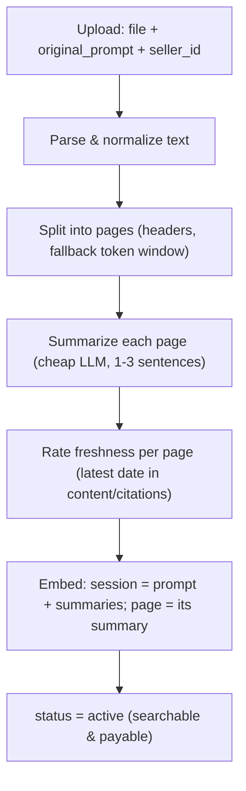
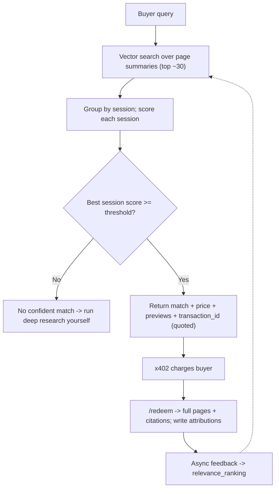

The backend exposes a **Data Core** contract for research ingestion, search,
paid-content redemption, feedback, and attribution. Two paths are implemented
today over Postgres/pgvector:

- **Ingestion** (`POST /ingest`, `GET /sessions/{id}/status`): upload →
  parse/normalize → split into pages (markdown headers, token-window fallback) →
  summarise each page (`gpt-4o-mini`) → rate freshness → embed
  (`text-embedding-3-small`; page = its summary, session = prompt + summaries) →
  persist → `status = active`. The pipeline runs in-process after the upload
  returns `202`; poll the status endpoint until `active`.
- **Search** (`POST /query`): preview-only cosine ranking over active sessions
  and their pages. Returns a confidence, a quoted price + transaction ID, and
  page previews (id, summary, citation) — never raw page text.
## Ingestion

## Retrieval & ranking

