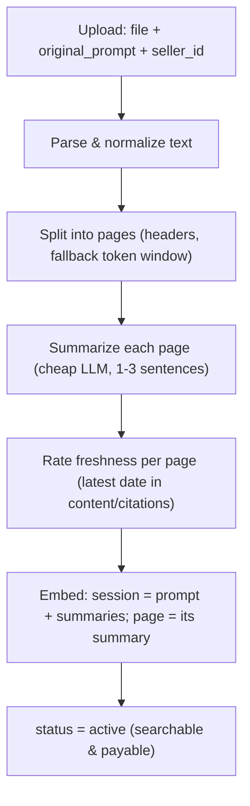
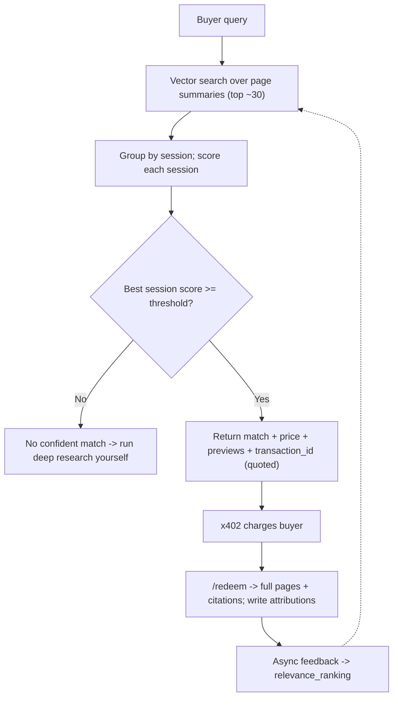

These are the diagrams of our data core: the part of CacheApp that turns an uploaded deep-research session into something **searchable and payable**, answers buyer queries with a real *"no confident match"* option, and records **who is owed what** on a served match.

## Ingestion

## Retrieval & ranking

