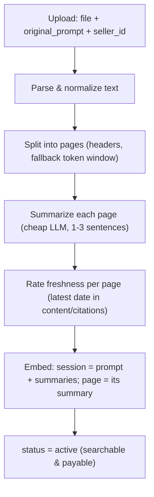
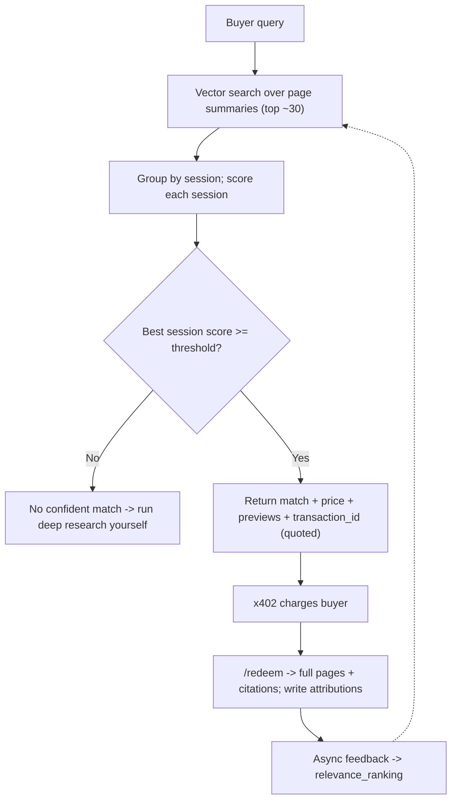

Current AI usage is wasteful. An AI agent performing "deep research" instantiates significant queries, analyses the same websites, and computes millions of identical tokens. A single comprehensive report can take hours and deplete hundreds of dollars in API costs.

By building a marketplace and MCP tool, CacheApp allows AI agents to buy and reuse pre-computed deep research sessions from a global corpus, amortising the high API costs over time. Instead of waiting for an agent to perform web searches, read PDFs, and compute data from scratch, a user's agent requests CacheApp and retrieves relevant re-usable research documents based on whether similar research questions have been previously proposed.

CacheApp enables users to bypass high per-token API costs by paying low fees to retrieve existing results. And, new research sessions can offset their high generation costs by enabling their creators to gain revenue from other users who re-use their research. CacheApp transforms AI deep research into efficient, environmentally-friendly workflows.

This is our data core, which is the contract for research ingestion, search,
paid-content redemption, feedback, and attribution. There are two paths, 
Ingestion, and Search. Agents will be able to communicate via endpoints exposed, saving their token usage for deep research. 
Sellers will make money, and buys will save on token costs.

- **Ingestion** (`POST /ingest`, `GET /sessions/{id}/status`): upload →
  parse/normalize → split into pages (markdown headers, token-window fallback) →
  summarise each page (`gpt-4o-mini`) → rate freshness → embed
  (`text-embedding-3-small`; page = its summary, session = prompt + summaries) →
  persist → `status = active`. The pipeline runs in-process after the upload
  returns `202`; poll the status endpoint until `active`.
- **Search** (`POST /query`): preview-only cosine ranking over active sessions
  and their pages. Returns a confidence, a quoted price + transaction ID, and
  page previews (id, summary, citation), never raw page text.
## Ingestion

## Retrieval & ranking

