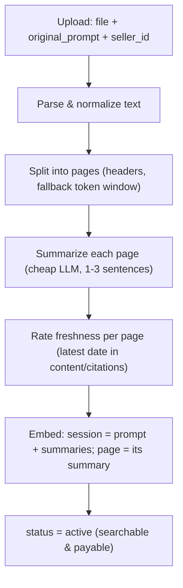
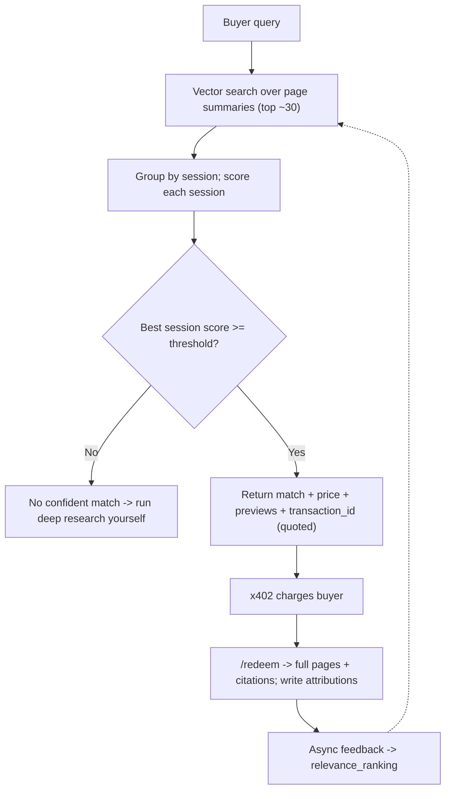

# CacheApp — Data Core

Source of truth for the Data Core: the part of CacheApp that turns an uploaded deep-research session into something **searchable and payable**, answers buyer queries with a real *"no confident match"* option, and records **who is owed what** on a served match.

It knows four nouns — **sessions, pages, matches, payout splits** — and nothing about wallets, terminals, or moving money.

---

## Concepts

| Term | Meaning |
|---|---|
| **Session** | One uploaded deep-research artifact: `{ original_prompt, document, seller }`. What a query resolves against. |
| **Page** | A semantically coherent section of a session (not a literal PDF page). The unit that is summarised, served, and rated. |
| **Summary** | A 1–3 sentence description of what a page answers. Each summary carries a **relevance ranking** and a **freshness** rating, which decide the best page to serve. |
| **Match** | A query resolved to a session and the specific pages that answer it, above a confidence threshold. |
| **Attribution** | The per-page credit split for one match. The only thing the payment workstream needs from us. |

Indexing: the **session** embedding is built from `original_prompt + all page summaries`; each **page** embedding is its summary alone.

---

## Ingestion

Upload is dumb — accept the file, return a `session_id`, do the rest async.



1. **Parse & normalize** — extract text, normalize whitespace/markdown, detect language. Non-text (charts, tables, images) is flagged unindexed, not dropped.
2. **Page split** — on headers first (deep research is usually already organised by sub-question); token-window fallback (~500–800 tokens, light overlap). Keep `order_index`.
3. **Summarise** — one cheap LLM call per page: *what does this page answer?* This is the indexed field.
4. **Freshness** — per page, derive a `freshness` score from the most recent date in its content/citations (neutral default where none is determinable).
5. **Embed** — session from `prompt + all summaries`; page from its summary. Store `embedding_model_version` for back-fill on model upgrades.
6. **Publish** — `status = active`.

---

## Data model

Postgres + `pgvector` as the single system of record — vectors, metadata, and payout data in one transactionally-consistent place, since money is attached to retrieval. Raw files and full page text live in S3-compatible storage; the DB holds pointers.

**sessions**

| field | type | notes |
|---|---|---|
| session_id | uuid PK | |
| seller_id | uuid FK | |
| original_prompt | text | anchors the session embedding |
| session_embedding | vector | `embed(prompt + page summaries)` |
| upload_date | timestamp | recency signal |
| category_tags | text[] | optional |
| status | enum | `pending` / `active` |
| price_base | numeric | flat |
| embedding_model_version | text | |

**pages**

| field | type | notes |
|---|---|---|
| page_id | uuid PK | |
| session_id | uuid FK | |
| order_index | int | reading order |
| raw_text_ref | text | pointer into object storage |
| summary_text | text | indexed field |
| summary_embedding | vector | `embed(summary_text)` |
| relevance_ranking | float | rolling quality prior from feedback |
| freshness | float | recency of the page's content, set at ingestion |
| times_used | int | |

**buyers** — minimal: `buyer_id`, identity handle, created_at.

**transactions** — one query→serve event: `transaction_id`, `buyer_id`, `session_id`, `query_text`, `price_charged`, `status` (`quoted` / `paid` / `served`).

**attributions** — per served page: `transaction_id`, `page_id`, `credit_weight`.

**feedback** — per rated page: `transaction_id`, `page_id`, `rating`, `source` (`llm_judge` / `implicit` / `explicit`).

---

## Retrieval & ranking

Page-first: find the best-matching pages, group by session, score the session, apply the gate.



**Page score** — pick the best-quality page using its ranking and freshness, not just similarity:

```
page_score(page, query) =
    sim(query, page.summary_embedding) * (1 + β * page.relevance_ranking + γ * page.freshness)
```

**Session score** — relevance, date, rating:

```
session_score(session, query) =
      w1 * mean(top page_scores in this session)   # relevance
    + w2 * recency(session.upload_date)             # date
    + w3 * session_rating(session)                  # rating
```

Weights are tuned offline against judged queries once feedback exists — not fixed constants.

**Match gate** is the key decision: a false positive charges a buyer for a bad answer, which costs more trust than a miss. MVP is a single threshold tuned to favour precision. `match: false` is a normal, expected outcome.

**Served content** is page excerpts + summaries + citations — not a synthesised narrative. The Data Core is a retrieval layer; the buyer's agent does final synthesis.

---

## Feedback

After a match is served, each served page is rated for how well it answered the **buyer's query** (that's what future ranking predicts).

- **LLM-judge** (primary) — post-hoc, query vs. served page. Fires without the buyer doing anything.
- **Implicit** — buyer re-queries something similar right after → negative signal.
- **Explicit** — buyer-submitted rating when available.

```
relevance_ranking = (1 - α) * relevance_ranking + α * new_rating
```

New pages start neutral until feedback accumulates.

---

## Attribution

Every served match writes an auditable split.

```
credit_weight(page_i) = page_score(page_i) / Σ page_score(page_j)      # over served pages
payout(page_i)        = credit_weight(page_i) * (1 - platform_fee) * price_charged
seller_payout(seller) = Σ payout(page_i) for that seller's pages
```

The Data Core computes who is owed what and hands `attributions` to the payment workstream. It never moves money. Pricing is flat for MVP.

---

## Internal Data Core API

The stable contract the **MCP/CLI** and **x402** workstreams build against, so they never touch the corpus, ranker, or payout math directly.

```
POST /ingest
  { seller_id, file, original_prompt, tags? } -> { session_id }
```
Dumb upload; kicks off the async pipeline and returns immediately.

```
GET /sessions/{id}/status
  -> { status: pending | active }
```
Ingestion is async — the seller UI needs to know when a session is live.

```
POST /query
  { buyer_id, query_text }
  -> { match: bool, confidence, price, previews: [{ page_id, summary, citation }], transaction_id }
```
The core entry point: *is this already researched well enough to buy?* Returns a decision, a price, and **previews only** — full content is withheld until payment. Does no payment itself.

```
POST /redeem
  { transaction_id }        # called by x402 after payment confirms
  -> { pages: [{ full_text, citations }] }
```
Releases paid content only after payment, and writes the attribution rows. Without this split, `/query` would leak paid research for free.

```
POST /feedback
  { transaction_id, page_id, rating, source }
```
Closes the ranking loop; updates `relevance_ranking`.

```
GET /attribution/{transaction_id}
  -> { splits: [{ page_id, seller_id, credit_weight, payout }] }
```
The settlement hand-off. x402 reads this to move USDC; the Data Core's job ends at computing the split.